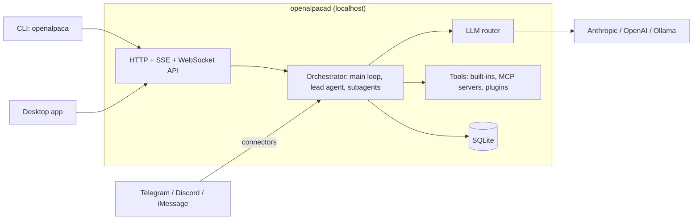

# OpenAlpaca

OpenAlpaca is a personal AI agent that runs on your own machine.
One background daemon does the work; a command-line tool and a desktop app talk to it.
It runs on a local Ollama model with no API key, or on Anthropic and OpenAI models with a key.

**Status:** version 0.1.0, a personal project under active development. The core paths work. Interfaces, config and the database schema still change. See [Status and limitations](#status-and-limitations).

## What you can do with it

- **Chat** from a terminal or the desktop app. Replies stream as they are written.
- **Use a local model.** A local Ollama needs no API key and costs nothing.
- **Hand off bigger jobs.** Ask for a workflow: a lead agent runs it in the background with subagents, then reports back in the chat.
- **Steer work in flight.** Check, pause, resume, cancel or redirect a running workflow from the same conversation.
- **Attach files** to a message, and keep what agents write as versioned artifacts.
- **Keep a memory.** What you ask it to remember is stored locally and searched by keyword and by meaning.
- **Add tools** with skills (markdown files), MCP servers and plugins. Each extension has an on/off switch.
- **Reach it from chat apps:** Telegram, Discord, and iMessage on macOS.

## Quick start

These steps build from source and end with a first reply. To package and install a release instead, read [docs/QuickStart_Manual.md](docs/QuickStart_Manual.md).

### 1. Prerequisites

- **Rust** through [rustup](https://rustup.rs). The repo pins 1.93.0 in `rust-toolchain.toml`; rustup fetches it on the first build.
- **A model:** [Ollama](https://ollama.com) running locally, or an Anthropic or OpenAI API key.
- **[Bun](https://bun.sh)**, only for the desktop app (step 6).
- Linux only: `sudo apt-get install -y libdbus-1-dev pkg-config`. The desktop app also needs [Tauri's system libraries](https://tauri.app/start/prerequisites/).

### 2. Build

```bash
git clone https://github.com/tangyunpei/OpenAlpaca.git
cd OpenAlpaca
cargo build -p openalpacad -p openalpaca
export PATH="$PWD/target/debug:$PATH"
```

This builds the daemon (`openalpacad`) and the CLI (`openalpaca`). The `export` lets this terminal find them.
Check it: `openalpaca --help` lists the commands.

### 3. Start the daemon

```bash
openalpaca daemon start --daemon-only
openalpaca daemon status
```

`start` prints the path of the daemon log and returns at once. `status` prints `✓ Daemon is running` once the daemon answers. If it says the daemon is not running, run it again a second later.

**The first start is slow.** The daemon downloads a local embedding model (about 1 GB) for memory search before it answers anything. Until then `status` may sit and wait. To watch the progress, open a second terminal and run `tail -f ~/.openalpaca/state/logs/daemon.log`. The line `Daemon ready` means it is up. Wait for it before step 4.

The first start also creates `~/.openalpaca/`. A daemon started this way reads its config from `~/.openalpaca/config/`, not from the repo's `config/`.

### 4. Pick a model

Every provider starts switched off. Turn one on. The running daemon picks the change up; no restart is needed.

**Option A: a local Ollama, no API key**

```bash
openalpaca config set ai.ollama.enabled true
ollama pull qwen3:8b                          # an example; any chat model works, tool-capable ones work best
openalpaca llm models --refresh               # lists what your Ollama has installed
```

**Option B: an API key**

```bash
openalpaca config set ai.anthropic.enabled true   # or: ai.openai.enabled
openalpaca llm keys add --provider anthropic      # or: openai
```

Keep this order: switch the provider on, then add the key. `keys add` asks for the key (hidden input), a source label and optional notes. The key is stored encrypted.

Check the result with `openalpaca llm status`. The seeded default model is a Claude id. When that model is not available, the router uses one that is, and the status output names it.

### 5. Send a first message

```bash
openalpaca chat --message "Hello, what can you do?"
openalpaca chat                               # interactive; type exit to leave
```

The reply streams into the terminal. With no provider switched on, the turn fails with an error that tells you to turn one on.

On a fresh install the assistant opens with a short getting-to-know-you conversation and cannot start workflows yet. It ends by itself once it has filled in your profile and its own identity. To skip it, delete `~/.openalpaca/config/orchestrator/BOOTSTRAP.md`. The next daemon start puts the file back until both are filled in.

### 6. Open the desktop app

```bash
cd apps/openalpaca-gui
bun install
bun run tauri dev
```

The first run compiles the app shell, so give it a few minutes. The app connects to the daemon you already started. If none is running, it starts one itself.

To stop the daemon: `openalpaca daemon stop`.

## How it works

One process, `openalpacad`, owns everything: the database, the agents, the model router and the tools. It listens on a random localhost port and writes the port and a bearer token to `~/.openalpaca/state/discovery.json`. The CLI and the desktop app read that file to connect, so they need no setup.



The path of one message:

1. Slash commands are routed without asking a model: `/status`, `/tasks`, `/cancel`, `/pause`, `/resume`, `/steer <text>`, and `/<skill>` to run a skill.
2. Everything else goes to the main loop. The model answers directly, or calls a tool: start a workflow, steer a running one, queue a follow-up, check a task, or store and search memory. A tool that needs confirmation pauses until you approve it.
3. A workflow runs in the background. A lead agent spawns subagents (up to eight per batch), waits for them, and posts a completion report to the chat.
4. The LLM router picks a provider and key for each call. If the requested model is not available, it falls back to one that is and says so.
5. Replies stream to the client over SSE. Task, agent and tool events stream over WebSocket. Conversations, tasks and memory are stored in SQLite.

More detail: [docs/agent-loop.md](docs/agent-loop.md) and [docs/Daemon_Manual.md](docs/Daemon_Manual.md).

## Project layout

A Rust workspace (edition 2024) with three apps and eight library crates.

| Path | What it is |
|---|---|
| `apps/openalpacad` | The daemon: HTTP, SSE and WebSocket API, and every service behind it |
| `apps/openalpaca` | The CLI: daemon lifecycle, chat, tasks, models and keys, extensions, config |
| `apps/openalpaca-gui` | The desktop app: Tauri v2 shell, React 19 + TypeScript + Tailwind v4 frontend |
| `crates/openalpaca_core` | Orchestrator, message routing, agent loop, tools, skills, security gate, event bus |
| `crates/openalpaca_llm` | LLM router, providers, key pools, rate limiting, cost tracking, embeddings |
| `crates/openalpaca_storage` | SQLite, migrations, repositories, memory search, the `~/.openalpaca` store, artifacts, uploads |
| `crates/openalpaca_api` | Shared event types and plugin executor traits |
| `crates/openalpaca_wake` | Cron scheduler and file watcher (scheduled skills, config hot reload) |
| `crates/openalpaca_connectors` | Telegram, iMessage and Discord adapters |
| `crates/openalpaca_mcp` | MCP client: stdio and streamable-HTTP transports |
| `crates/openalpaca_plugins` | Out-of-process plugins: JSON-RPC over stdio, manifests, approval gate |

## Configuration and data

Config is plain files. The daemon reloads most of them when they change. Edit them by hand, with `openalpaca config`, or in the app's Settings.

| File | Purpose |
|---|---|
| `llm.toml` | Providers, keys (encrypted), default model, fallback chains, embeddings. Created on first start; git-ignored in the repo. |
| `daemon.toml` | Execution limits, cost caps, routing, sessions, uploads, security, server settings. The repo's `config/daemon.toml` is the full reference; a fresh install gets a shorter file and built-in defaults. |
| `mcp.toml` | MCP server declarations and each server's on/off switch. |
| `agents/*.md` | Agent templates: YAML frontmatter (model, capabilities, limits) plus a persona. Nine ship. |
| `skills/*/SKILL.md` | Skills. Four ship: `code-review`, `commit-message`, `create-skill`, `explain-code`. |
| `orchestrator/*.md` | The assistant's persona documents (`SOUL.md`, `USER.md`, `IDENTITY.md`), created on first start. |

Which directory holds them:

- Started by the CLI or the desktop app: `~/.openalpaca/config/`. The first start fills it with defaults.
- Started by hand (`cargo run -p openalpacad`): the directory `OPENALPACA_CONFIG_DIR` names, when it exists. Otherwise the daemon searches upward for a `config/llm.toml`, then falls back to `./config`.

Data always lives under `~/.openalpaca/`, on every platform:

| Path | Holds |
|---|---|
| `state/` | The database, `discovery.json`, the lock, the master key, logs, backups, the embedding model cache |
| `config/`, `plugins/` | Runtime config and installed plugins |
| `artifacts/`, `uploads/`, `sessions/` | What agents wrote, what you attached, and conversation logs |

Set `OPENALPACA_HOME_STORE=/absolute/path` to move the whole root, for example to try things in a sandbox. A project can also hold its own `<project>/.openalpaca/` for artifacts and uploads.

## Documentation

| Document | Read it when |
|---|---|
| [docs/QuickStart_Manual.md](docs/QuickStart_Manual.md) | You want to package and install a release rather than build from source |
| [docs/Installation_Manual.md](docs/Installation_Manual.md) | You need install details, local-model setup, upgrades, or troubleshooting |
| [docs/CLI_Manual.md](docs/CLI_Manual.md) | You use the `openalpaca` command |
| [docs/GUI_Manual.md](docs/GUI_Manual.md) | You use the desktop app |
| [docs/Daemon_Manual.md](docs/Daemon_Manual.md) | You run or configure the daemon, or call its API |
| [docs/agent-loop.md](docs/agent-loop.md) | You want to know how a turn, a workflow and steering work |
| [docs/Skill_Template_Reference.md](docs/Skill_Template_Reference.md) | You write a skill |
| [docs/tools/DESIGN.md](docs/tools/DESIGN.md), [TECHNICAL.md](docs/tools/TECHNICAL.md) | You work on the tool system |
| [apps/openalpaca-gui/README.md](apps/openalpaca-gui/README.md) | You work on the desktop app |
| [docs/api/README.md](docs/api/README.md) | You need the generated API and schema reference |

## Development

```bash
cargo build -p openalpacad -p openalpaca                      # the daemon and the CLI
cargo build --workspace --exclude openalpaca_gui              # everything but the desktop shell, as CI builds it
cargo test --workspace --exclude openalpaca_gui               # all Rust tests, as CI runs them
cargo clippy --workspace --exclude openalpaca_gui --all-targets

cd apps/openalpaca-gui && bun install
bun run check && bun run test && bun run format:check && bun run build
```

- A bare `cargo build` or `cargo test` covers the library crates only. Name the apps with `-p`, or use `--workspace`.
- CI (`.github/workflows/ci.yml`) has three jobs: the Rust build, tests and clippy above; the four `bun run` gates; and the Windows install-script tests.
- To run the daemon in the foreground on the repo's own config, use `OPENALPACA_CONFIG_DIR="$PWD/config" cargo run -p openalpacad`. Export the same variable for the CLI, so `openalpaca config set` edits the same files.
- `docs/api/` is generated. Run `python3 scripts/gen_api_docs.py`; never edit it by hand.
- Toolchain: Rust 1.93.0. Frontend: Bun, TypeScript 7, React 19, Vite 7, Tailwind 4, Vitest 4.

## Status and limitations

- **Moving target.** Config keys, API routes and the database schema change between commits. `001_baseline.sql` initializes schema version 42; existing version-42 databases remain usable, but earlier development schemas are no longer upgraded.
- **Platforms.** Developed on macOS. CI builds and tests on Linux. Windows has packaging scripts, but CI does not build the Rust workspace there.
- **Plugins** can add tools, skills and agent templates. Plugin connectors and plugin LLM providers are declared in the manifest format but not wired. They do not work.
- **MCP** is client-side and tools only. MCP resources and prompts are not implemented: the client has no resource or prompt methods. Serving MCP is not a goal.
- **Desktop app.** Two controls are shown as unavailable because the daemon has no route for them: adding a connector, and the per-agent-template on/off switch.
- **Resuming an interrupted run** by replay is experimental and off by default (`resume_enabled` in `daemon.toml`).
- **Costs.** A chat turn is capped at $1. A workflow's lead agent is capped at $3 by its shipped template (`daemon.toml` defaults to $5 where a template sets nothing). There is no overall daily budget; only the small background jobs (profile extraction, summaries, task extraction) have daily ceilings.
- **Releases are unsigned.** The macOS package is not code-signed.
- **License:** MIT, as declared in `Cargo.toml`.
